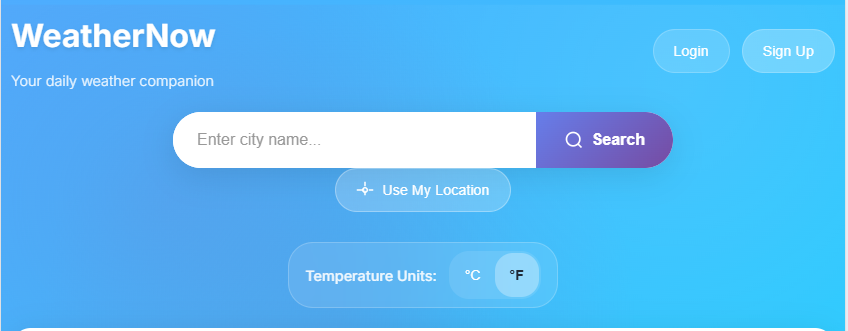
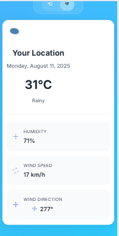

# 🌤️ WeatherNow - Responsive Weather Dashboard

A modern, responsive weather application built with Flask backend and vanilla JavaScript frontend. Features user authentication, personalized settings, favorite cities, and a beautiful responsive design that works seamlessly across all devices.

## ✨ Features

### 🌍 **Weather Information**
- **Current Weather**: Real-time weather data with animated weather icons
- **5-Day Forecast**: Extended weather predictions with daily breakdowns
- **Weather Details**: Humidity, wind speed, pressure, visibility, and more
- **Interactive Map**: Leaflet.js powered weather map with multiple layers
- **Location Services**: GPS-based current location weather

### 🔐 **User Authentication**
- **User Registration**: Create personalized accounts
- **Secure Login**: Password-protected user access
- **Session Management**: Persistent login state
- **User Profiles**: Individual user settings and preferences

### ⚙️ **Personalized Settings**
- **Temperature Units**: Toggle between Celsius and Fahrenheit
- **User Preferences**: Save and restore individual settings
- **Cross-Device Sync**: Settings persist across sessions

### ❤️ **Favorite Cities**
- **Save Cities**: Add frequently visited cities to favorites
- **Quick Access**: Instant weather lookup for saved locations
- **Manage Favorites**: Add/remove cities from your list
- **Persistent Storage**: Favorites saved in user database

### 📱 **Responsive Design**
- **Mobile-First**: Optimized for mobile devices
- **Cross-Platform**: Works on desktop, tablet, and mobile
- **Touch-Friendly**: Optimized touch targets and interactions
- **Adaptive Layouts**: Automatically adjusts to screen size
- **Multiple Breakpoints**: 8 responsive breakpoints for optimal experience

## 🚀 Technology Stack

### **Backend**
- **Flask**: Python web framework
- **SQLAlchemy**: Database ORM
- **SQLite**: Lightweight database
- **Flask-CORS**: Cross-origin resource sharing
- **Werkzeug**: Security utilities

### **Frontend**
- **Vanilla JavaScript**: Modern ES6+ features
- **CSS3**: Advanced styling with animations
- **HTML5**: Semantic markup
- **Responsive Design**: Mobile-first approach
- **Progressive Web App**: PWA-ready features

### **External APIs**
- **OpenWeatherMap**: Weather data provider
- **Leaflet.js**: Interactive mapping library

## 📱 Responsive Breakpoints

| Device Type | Breakpoint | Layout Features |
|-------------|------------|-----------------|
| **Large Desktop** | 1400px+ | 4-column weather details, 5-column forecast |
| **Desktop** | 1024px - 1399px | 4-column weather details, 5-column forecast |
| **Tablet Landscape** | 769px - 1023px | 2-column weather details, 3-column forecast |
| **Tablet Portrait** | 768px and below | 2-column weather details, 2-column forecast |
| **Mobile Large** | 600px and below | 1-column weather details, 2-column forecast |
| **Mobile Medium** | 480px and below | 1-column layout, optimized spacing |
| **Mobile Small** | 360px and below | Compact layout, smaller fonts |
| **Extra Small Mobile** | 320px and below | Minimal layout, touch-optimized |

## 🛠️ Installation & Setup

### **Prerequisites**
- Python 3.7 or higher
- pip (Python package manager)
- Modern web browser

### **1. Clone the Repository**
```bash
git clone <repository-url>
cd weather
```

### **2. Install Dependencies**
```bash
pip install -r requirements.txt
```

### **3. Environment Setup**
Create a `.env` file in the root directory:
```env
SECRET_KEY=your-secret-key-here
OPENWEATHER_API_KEY=your-openweather-api-key
```

### **4. Run the Application**
```bash
python app.py
```

The application will be available at `http://localhost:5000`

## 📁 Project Structure

```
weather/
├── app.py                 # Flask backend application
├── requirements.txt       # Python dependencies
├── README.md             # Project documentation
├── .env                  # Environment variables (create this)
├── static/               # Static assets
│   ├── css/
│   │   └── styles.css    # Responsive CSS styles
│   └── js/
│       └── script.js     # Frontend JavaScript
├── templates/            # HTML templates
│   └── index.html        # Main application template
└── instance/             # Database files (auto-created)
    └── weather_app.db    # SQLite database
```

## 🔧 Configuration

### **API Keys**
- **OpenWeatherMap**: Get your API key from [OpenWeatherMap](https://openweathermap.org/api)
- **Secret Key**: Generate a secure secret key for Flask sessions

### **Database**
The application uses SQLite by default. The database will be automatically created on first run.

## 📱 Responsive Features

### **Mobile Optimizations**
- **Touch-Friendly**: 44px minimum touch targets
- **No Zoom**: Prevents unwanted zoom on input focus
- **Smooth Scrolling**: Optimized scrolling performance
- **Adaptive Typography**: Font sizes scale with screen size
- **Flexible Grids**: Layouts adapt to available space

### **Desktop Enhancements**
- **Multi-Column Layouts**: Efficient use of wide screens
- **Hover Effects**: Interactive hover states
- **Large Typography**: Readable text on large displays
- **Spacious Layouts**: Comfortable spacing and margins

### **Cross-Device Compatibility**
- **Orientation Support**: Handles portrait and landscape modes
- **High DPI Support**: Optimized for retina displays
- **Print Styles**: Clean print layout
- **Accessibility**: Focus states and keyboard navigation

## 🎨 Design Features

### **Visual Elements**
- **Animated Weather Icons**: Dynamic weather representations
- **Gradient Backgrounds**: Beautiful color schemes
- **Smooth Transitions**: Elegant animations and effects
- **Modern UI**: Clean, contemporary design language

### **User Experience**
- **Intuitive Navigation**: Easy-to-use interface
- **Responsive Feedback**: Visual feedback for all interactions
- **Loading States**: Clear indication of data loading
- **Error Handling**: User-friendly error messages

## 🔐 API Endpoints

| Endpoint | Method | Description |
|----------|--------|-------------|
| `/` | GET | Main application page |
| `/api/register` | POST | User registration |
| `/api/login` | POST | User authentication |
| `/api/logout` | POST | User logout |
| `/api/user` | GET | Get user information |
| `/api/settings` | PUT | Update user settings |
| `/api/favorites` | GET | Get user favorites |
| `/api/favorites` | POST | Add city to favorites |
| `/api/favorites/<id>` | DELETE | Remove city from favorites |
| `/api/check-auth` | GET | Check authentication status |

## 🚀 Deployment

### **Development**
```bash
python app.py
```

### **Production**
For production deployment, consider:
- Using a production WSGI server (Gunicorn, uWSGI)
- Setting up a reverse proxy (Nginx, Apache)
- Implementing HTTPS
- Using environment variables for configuration
- Setting up proper logging and monitoring

## 🧪 Testing

### **Manual Testing**
1. Test responsive design across different screen sizes
2. Verify authentication flows (register, login, logout)
3. Test favorite cities functionality
4. Check weather data display and updates
5. Verify mobile touch interactions

### **Browser Testing**
- Chrome (desktop & mobile)
- Firefox (desktop & mobile)
- Safari (desktop & mobile)
- Edge (desktop & mobile)

## 🤝 Contributing

1. Fork the repository
2. Create a feature branch
3. Make your changes
4. Test thoroughly
5. Submit a pull request

## 📄 License

This project is licensed under the MIT License - see the LICENSE file for details.

## 🙏 Acknowledgments

- **OpenWeatherMap** for weather data API
- **Leaflet.js** for interactive mapping
- **Flask** community for the excellent web framework
- **Inter font family** for beautiful typography

## 📞 Support

For support and questions:
- Create an issue in the repository
- Check the documentation
- Review the code comments

# Weather Dashboard

A simple web app that displays temperature, humidity, wind speed, and weather conditions for any city.

## Screenshots

### Desktop View


### Mobile View


---

**Built with ❤️ using Flask and modern web technologies**
